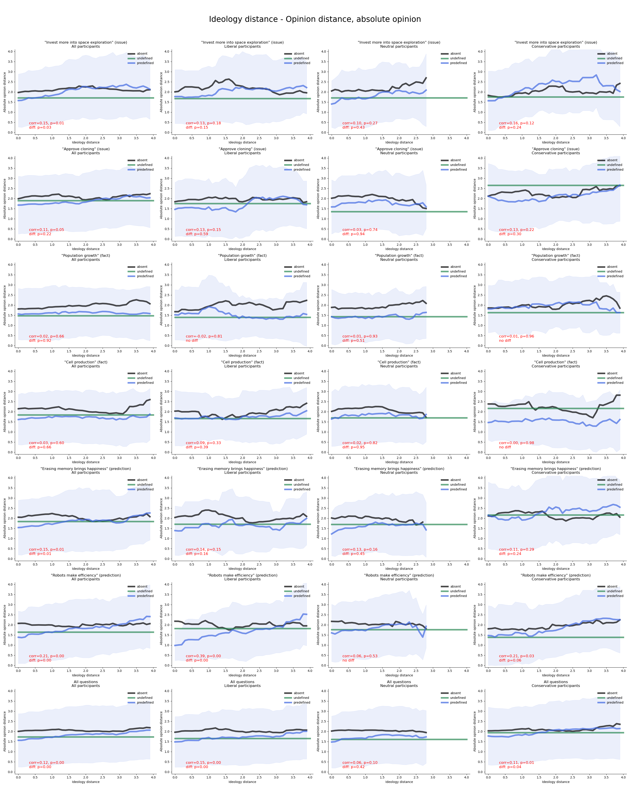
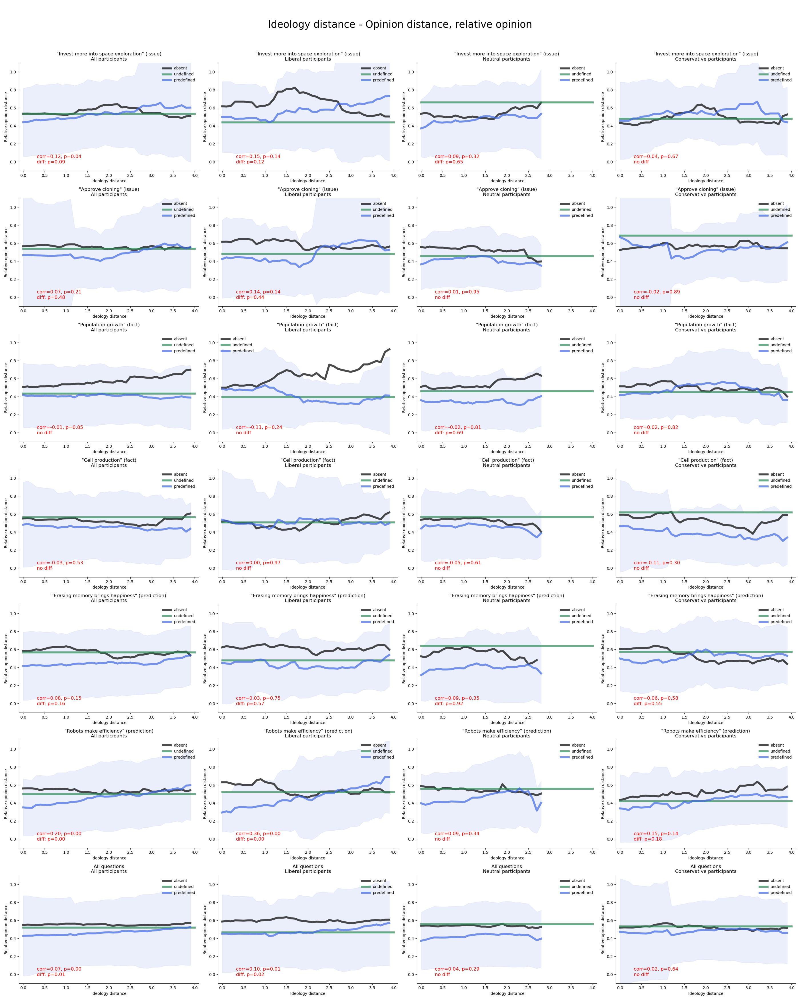
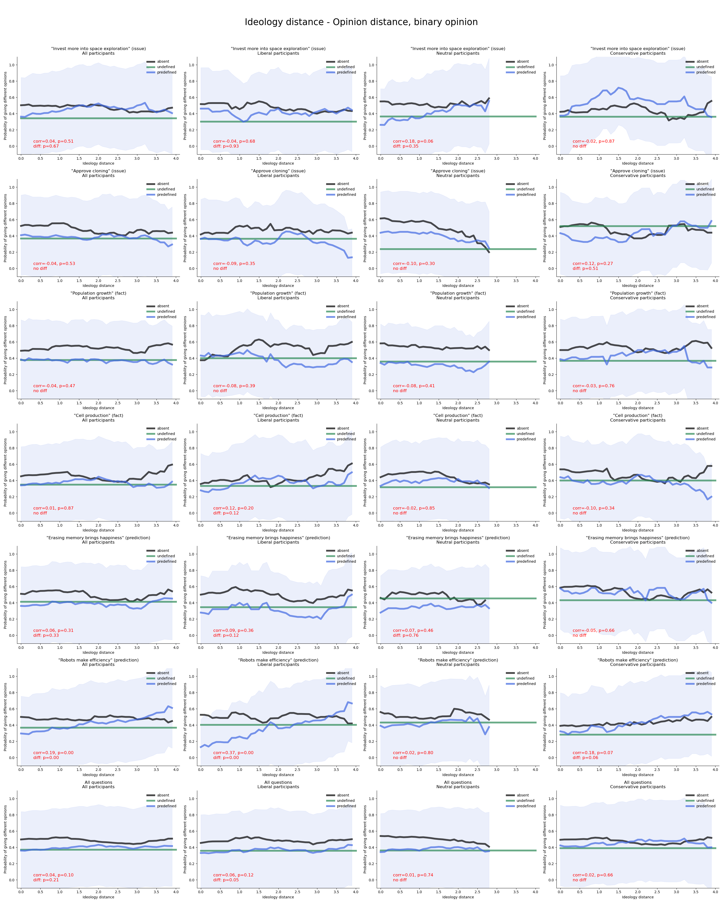

#  2024-02-08 Condition Report
Dawei Guo

## 1. Background
In this report, we explore two different ways to process participants' answers:
1. Transform all answers into binary values 0 or 1.

$$
\text{answer}' = \begin{cases} 
0 & \text{if } \text{answer} < 0, \\
1 & \text{if } \text{answer} \geq 0
\end{cases}
$$

2. Given that each participant has a different answer range, we use relative answers instead of absolute answers to represent his opinion. ($max$ is the maximum value of the participants' 6 answers in Phase II, and $min$ is the minimum one):

$$
\text{answer}' = \frac{answer - min}{max - min}
$$

## 2. Ideology distance - Opinion distance
These participants are excluded from the analysis:
- Those who failed the attention check.
- Those who labeled all participants' ideologies as exactly 0.

These two values are calculated and displayed on each figure:
1. Correlation of ideology distance and opinion distance (transformed), and its p-value;
2. For the **Predefined** curve, whether the opinion distance when ideology distance is in $[0, 1]$ is significantly smaller than that when ideology distance is in $[\text{max} - 1, \text{max}]$. (We use $\text{max}$ to represent the biggest ideology distance for the data of the figure), and its p-value.

All figures are displayed as follows:

### 2.1. Absolute opinion

### 2.2. Relative opinion

### 2.3. Binary opinion

## 3. Further Compare Predefined & Undefined Opinion

We then compare **predefined** & **undefined** opinions given different ideology distance ranges.

### ***Invest more into space exploration (issue)***, All participants
|          | 0-1              | 1-2              | 2-3              | 3-4              |
|:---------|:-----------------|:-----------------|:-----------------|:-----------------|
| Absolute | pre < un, p=0.65 | pre > un, p=0.13 | pre > un, p=0.16 | pre > un, p=0.23 |
| Relative | pre < un, p=0.03 | pre > un, p=0.34 | pre > un, p=0.06 | pre > un, p=0.52 |
| Binary   | pre > un, p=0.54 | pre > un, p=0.22 | pre > un, p=0.24 | pre > un, p=0.25 |

### ***Invest more into space exploration (issue)***, Liberal participants
|          | 0-1              | 1-2              | 2-3              | 3-4   |
|:---------|:-----------------|:-----------------|:-----------------|:------|
| Absolute | pre > un, p=0.53 | pre > un, p=0.39 | pre > un, p=0.29 |       |
| Relative | pre > un, p=0.20 | pre > un, p=0.45 | pre > un, p=0.25 |       |
| Binary   | pre > un, p=0.28 | pre > un, p=0.55 | pre > un, p=0.27 |       |

### ***Invest more into space exploration (issue)***, Neutral participants
|          | 0-1              | 1-2              | 2-3   | 3-4   |
|:---------|:-----------------|:-----------------|:------|:------|
| Absolute | pre < un, p=0.61 | pre > un, p=0.60 |       |       |
| Relative | pre < un, p=0.03 | pre > un, p=0.84 |       |       |
| Binary   | pre > un, p=0.84 | pre > un, p=0.76 |       |       |

### ***Invest more into space exploration (issue)***, Conservative participants
|          | 0-1              | 1-2              | 2-3              | 3-4              |
|:---------|:-----------------|:-----------------|:-----------------|:-----------------|
| Absolute | pre < un, p=0.56 | pre > un, p=0.07 | pre > un, p=0.17 | pre > un, p=0.02 |
| Relative | pre < un, p=0.13 | pre > un, p=0.22 | pre > un, p=0.07 | pre > un, p=0.13 |
| Binary   | pre < un, p=0.87 | pre > un, p=0.03 | pre > un, p=0.47 | pre > un, p=0.42 |

### ***Approve cloning (issue)***, All participants
|          | 0-1              | 1-2              | 2-3              | 3-4              |
|:---------|:-----------------|:-----------------|:-----------------|:-----------------|
| Absolute | pre > un, p=0.54 | pre < un, p=0.01 | pre < un, p=0.21 | pre < un, p=0.06 |
| Relative | pre < un, p=0.68 | pre < un, p=0.00 | pre < un, p=0.31 | pre < un, p=0.22 |
| Binary   | pre > un, p=0.07 | pre < un, p=0.31 | pre < un, p=0.59 | pre < un, p=0.10 |

### ***Approve cloning (issue)***, Liberal participants
|          | 0-1              | 1-2              | 2-3              | 3-4   |
|:---------|:-----------------|:-----------------|:-----------------|:------|
| Absolute | pre < un, p=0.85 | pre < un, p=0.08 | pre < un, p=0.71 |       |
| Relative | pre > un, p=0.77 | pre < un, p=0.04 | pre < un, p=0.51 |       |
| Binary   | pre > un, p=0.70 | pre < un, p=0.32 | pre < un, p=0.73 |       |

### ***Approve cloning (issue)***, Neutral participants
|          | 0-1              | 1-2              | 2-3   | 3-4   |
|:---------|:-----------------|:-----------------|:------|:------|
| Absolute | pre > un, p=0.30 | pre < un, p=0.75 |       |       |
| Relative | pre < un, p=0.42 | pre < un, p=0.62 |       |       |
| Binary   | pre > un, p=0.05 |                  |       |       |

### ***Approve cloning (issue)***, Conservative participants
|          | 0-1              | 1-2              | 2-3              | 3-4              |
|:---------|:-----------------|:-----------------|:-----------------|:-----------------|
| Absolute | pre < un, p=0.78 | pre < un, p=0.05 | pre < un, p=0.52 | pre < un, p=0.26 |
| Relative | pre < un, p=0.90 | pre < un, p=0.03 | pre > un, p=0.92 | pre < un, p=0.41 |
| Binary   | pre > un, p=0.90 | pre < un, p=0.39 | pre > un, p=0.80 | pre < un, p=0.45 |

### ***Population growth (fact)***, All participants
|          | 0-1              | 1-2              | 2-3              | 3-4              |
|:---------|:-----------------|:-----------------|:-----------------|:-----------------|
| Absolute | pre > un, p=0.30 | pre < un, p=0.30 | pre > un, p=0.75 | pre > un, p=0.30 |
| Relative | pre < un, p=0.28 | pre < un, p=0.25 | pre < un, p=0.67 | pre > un, p=0.26 |
| Binary   | pre > un, p=0.83 | pre < un, p=0.38 | pre < un, p=0.78 | pre > un, p=0.30 |

### ***Population growth (fact)***, Liberal participants
|          | 0-1              | 1-2              | 2-3              | 3-4   |
|:---------|:-----------------|:-----------------|:-----------------|:------|
| Absolute | pre > un, p=0.31 | pre > un, p=0.34 | pre < un, p=0.83 |       |
| Relative | pre > un, p=0.33 | pre > un, p=0.41 | pre < un, p=0.19 |       |
| Binary   |                  | pre > un, p=0.15 | pre < un, p=0.16 |       |

### ***Population growth (fact)***, Neutral participants
|          | 0-1              | 1-2              | 2-3   | 3-4   |
|:---------|:-----------------|:-----------------|:------|:------|
| Absolute | pre < un, p=0.67 | pre < un, p=0.06 |       |       |
| Relative | pre < un, p=0.04 | pre < un, p=0.11 |       |       |
| Binary   | pre < un, p=0.85 | pre < un, p=0.08 |       |       |

### ***Population growth (fact)***, Conservative participants
|          | 0-1              | 1-2              | 2-3              | 3-4              |
|:---------|:-----------------|:-----------------|:-----------------|:-----------------|
| Absolute | pre > un, p=0.20 | pre < un, p=0.77 | pre > un, p=0.61 | pre > un, p=0.09 |
| Relative | pre < un, p=0.95 | pre < un, p=0.79 | pre > un, p=0.53 | pre > un, p=0.13 |
| Binary   | pre > un, p=0.65 | pre < un, p=0.81 | pre > un, p=0.39 | pre > un, p=0.24 |

### ***Cell production (fact)***, All participants
|          | 0-1              | 1-2              | 2-3              | 3-4   |
|:---------|:-----------------|:-----------------|:-----------------|:------|
| Absolute | pre < un, p=0.43 | pre < un, p=0.24 | pre < un, p=0.55 |       |
| Relative | pre < un, p=0.07 | pre < un, p=0.18 | pre < un, p=0.96 |       |
| Binary   | pre > un, p=0.74 | pre < un, p=0.55 | pre < un, p=0.98 |       |

### ***Cell production (fact)***, Liberal participants
|          | 0-1              | 1-2              | 2-3   | 3-4   |
|:---------|:-----------------|:-----------------|:------|:------|
| Absolute | pre < un, p=0.81 | pre < un, p=0.64 |       |       |
| Relative | pre < un, p=0.49 | pre > un, p=0.90 |       |       |
| Binary   | pre < un, p=0.85 | pre < un, p=0.65 |       |       |

### ***Cell production (fact)***, Neutral participants
|          | 0-1              | 1-2              | 2-3   | 3-4   |
|:---------|:-----------------|:-----------------|:------|:------|
| Absolute | pre < un, p=0.47 | pre > un, p=0.75 |       |       |
| Relative | pre < un, p=0.11 | pre > un, p=0.78 |       |       |
| Binary   | pre < un, p=0.94 | pre > un, p=0.56 |       |       |

### ***Cell production (fact)***, Conservative participants
|          | 0-1              | 1-2              | 2-3              | 3-4   |
|:---------|:-----------------|:-----------------|:-----------------|:------|
| Absolute | pre < un, p=0.95 | pre < un, p=0.03 | pre < un, p=0.60 |       |
| Relative | pre < un, p=0.52 | pre < un, p=0.01 | pre < un, p=0.90 |       |
| Binary   | pre > un, p=0.29 | pre < un, p=0.27 | pre > un, p=0.53 |       |

### ***Erasing memory brings happiness (prediction)***, All participants
|          | 0-1              | 1-2              | 2-3              | 3-4              |
|:---------|:-----------------|:-----------------|:-----------------|:-----------------|
| Absolute | pre > un, p=0.08 | pre > un, p=0.71 | pre > un, p=0.49 | pre < un, p=0.40 |
| Relative | pre < un, p=0.42 | pre < un, p=0.79 | pre > un, p=0.82 | pre < un, p=0.49 |
| Binary   | pre > un, p=0.12 | pre < un, p=0.90 | pre > un, p=0.63 | pre < un, p=0.21 |

### ***Erasing memory brings happiness (prediction)***, Liberal participants
|          | 0-1              | 1-2              | 2-3              | 3-4   |
|:---------|:-----------------|:-----------------|:-----------------|:------|
| Absolute | pre > un, p=0.75 | pre < un, p=0.25 | pre > un, p=0.23 |       |
| Relative | pre > un, p=0.59 | pre < un, p=0.20 | pre > un, p=0.63 |       |
| Binary   | pre > un, p=0.43 | pre < un, p=0.35 | pre > un, p=0.71 |       |

### ***Erasing memory brings happiness (prediction)***, Neutral participants
|          | 0-1              | 1-2              | 2-3   | 3-4   |
|:---------|:-----------------|:-----------------|:------|:------|
| Absolute | pre > un, p=0.48 | pre > un, p=0.75 |       |       |
| Relative | pre < un, p=0.24 | pre < un, p=0.72 |       |       |
| Binary   | pre > un, p=0.86 | pre > un, p=0.86 |       |       |

### ***Erasing memory brings happiness (prediction)***, Conservative participants
|          | 0-1              | 1-2              | 2-3              | 3-4              |
|:---------|:-----------------|:-----------------|:-----------------|:-----------------|
| Absolute | pre > un, p=0.11 | pre > un, p=0.30 | pre > un, p=0.88 | pre < un, p=0.91 |
| Relative | pre > un, p=0.05 | pre > un, p=0.42 | pre > un, p=0.73 | pre < un, p=0.79 |
| Binary   | pre > un, p=0.02 | pre > un, p=0.27 | pre > un, p=0.93 | pre < un, p=0.29 |

### ***Robots make efficiency (prediction)***, All participants
|          | 0-1              | 1-2              | 2-3              | 3-4              |
|:---------|:-----------------|:-----------------|:-----------------|:-----------------|
| Absolute | pre > un, p=0.98 | pre > un, p=0.16 | pre > un, p=0.35 | pre < un, p=0.20 |
| Relative | pre < un, p=0.09 | pre > un, p=0.41 | pre > un, p=0.73 | pre < un, p=0.56 |
| Binary   | pre > un, p=0.36 | pre > un, p=0.39 | pre > un, p=0.87 | pre < un, p=0.46 |

### ***Robots make efficiency (prediction)***, Liberal participants
|          | 0-1              | 1-2              | 2-3              | 3-4   |
|:---------|:-----------------|:-----------------|:-----------------|:------|
| Absolute | pre < un, p=0.55 | pre < un, p=0.35 | pre < un, p=0.71 |       |
| Relative | pre < un, p=0.59 | pre < un, p=0.32 | pre < un, p=0.62 |       |
| Binary   | pre > un, p=0.97 | pre < un, p=0.83 | pre < un, p=0.31 |       |

### ***Robots make efficiency (prediction)***, Neutral participants
|          | 0-1              | 1-2              | 2-3   | 3-4   |
|:---------|:-----------------|:-----------------|:------|:------|
| Absolute | pre > un, p=0.85 | pre > un, p=0.16 |       |       |
| Relative | pre < un, p=0.22 | pre > un, p=0.35 |       |       |
| Binary   | pre > un, p=0.42 | pre > un, p=0.60 |       |       |

### ***Robots make efficiency (prediction)***, Conservative participants
|          | 0-1              | 1-2              | 2-3              | 3-4              |
|:---------|:-----------------|:-----------------|:-----------------|:-----------------|
| Absolute | pre > un, p=0.69 | pre > un, p=0.56 | pre > un, p=0.11 | pre < un, p=0.32 |
| Relative | pre < un, p=0.47 | pre > un, p=0.82 | pre > un, p=0.11 | pre < un, p=0.40 |
| Binary   | pre > un, p=0.37 | pre > un, p=0.88 | pre > un, p=0.16 | pre < un, p=0.41 |

### ***All questions***, All participants
|          | 0-1              | 1-2              | 2-3              | 3-4              |
|:---------|:-----------------|:-----------------|:-----------------|:-----------------|
| Absolute | pre > un, p=0.38 | pre < un, p=0.62 | pre > un, p=0.57 | pre < un, p=0.40 |
| Relative | pre < un, p=0.00 | pre < un, p=0.13 | pre > un, p=0.92 | pre < un, p=0.95 |
| Binary   | pre > un, p=0.03 | pre < un, p=0.88 | pre > un, p=0.69 | pre < un, p=0.61 |

### ***All questions***, Liberal participants
|          | 0-1              | 1-2              | 2-3              | 3-4   |
|:---------|:-----------------|:-----------------|:-----------------|:------|
| Absolute | pre > un, p=0.75 | pre < un, p=0.29 | pre > un, p=0.76 |       |
| Relative | pre > un, p=0.61 | pre < un, p=0.21 | pre < un, p=0.42 |       |
| Binary   | pre > un, p=0.42 | pre < un, p=0.82 | pre < un, p=0.40 |       |

### ***All questions***, Neutral participants
|          | 0-1              | 1-2              | 2-3   | 3-4   |
|:---------|:-----------------|:-----------------|:------|:------|
| Absolute | pre > un, p=0.87 | pre > un, p=0.68 |       |       |
| Relative | pre < un, p=0.00 | pre < un, p=0.87 |       |       |
| Binary   | pre > un, p=0.22 | pre < un, p=1.00 |       |       |

### ***All questions***, Conservative participants
|          | 0-1              | 1-2              | 2-3              | 3-4              |
|:---------|:-----------------|:-----------------|:-----------------|:-----------------|
| Absolute | pre > un, p=0.39 | pre < un, p=0.76 | pre > un, p=0.39 | pre < un, p=0.75 |
| Relative | pre < un, p=0.44 | pre < un, p=0.23 | pre > un, p=0.09 | pre < un, p=0.81 |
| Binary   | pre > un, p=0.06 | pre > un, p=0.61 | pre > un, p=0.12 | pre < un, p=0.75 |

